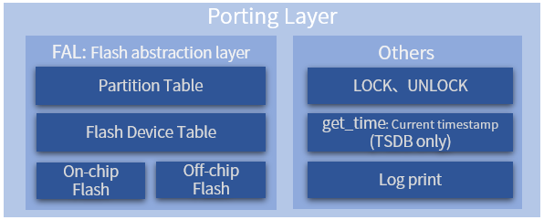

# Porting Guide

The underlying Flash management and operation of FlashDB relies on RT-Thread's FAL (Flash Abstraction Layer) Flash abstraction layer open source software package. This open source library also supports running on **bare metal platform** [(click to view introduction)](http:/ /packages.rt-thread.org/detail.html?package=fal). So only need to connect the used Flash to FAL to complete the whole transplantation work.

## Introduction to Porting



The main work of transplantation is on the FAL side. Other interfaces are not strongly dependent, and can be connected according to your own situation.

It is recommended to understand the FAL function introduction before transplantation, see: http://packages.rt-thread.org/detail.html?package=fal

The bottom layer of FAL encapsulates different Flash storage media in a unified manner and provides a partition table mechanism to expose it to upper users.

Each database of FlashDB is based on the partitioning mechanism provided by FAL. Each database is located on a FAL partition, which is equivalent to a partition corresponding to a database.

The following will explain the FAL porting process in detail. For more porting demonstrations, please refer to the demo provided.

## FAL migration

### Define flash device

Before defining the Flash device table, you need to define the Flash device first. It can be on-chip flash, or off-chip SFUD-based spi flash:

- Refer to [`fal_flash_stm32f2_port.c`](https://github.com/RT-Thread-packages/fal/blob/master/samples/porting/fal_flash_stm32f2_port.c) to define the on-chip flash device.
- Refer to [`fal_flash_sfud_port.c`](https://github.com/RT-Thread-packages/fal/blob/master/samples/porting/fal_flash_sfud_port.c) to define off-chip spi flash device.

To define specific Flash device objects, users need to implement the operation functions of ʻinit`, `read`, `write`, ʻerase` according to their own Flash conditions:

- `static int init(void)`: **Optional** initialization operation.
- `static int read(long offset, uint8_t *buf, size_t size)`: read operation.

| Parameters | Description |
| ------ | ------------------------- |
| offset | Flash offset address for reading data |
| buf | Buffer to store the data to be read |
| size | The size of the data to be read |
| return | Return the actual read data size |

- `static int write(long offset, const uint8_t *buf, size_t size)`: write operation.

| Parameters | Description |
| ------ | ------------------------- |
| offset | Flash offset address for writing data |
| buf | Buffer for storing data to be written |
| size | The size of the data to be written |
| return | Return the actual written data size |

- `static int erase(long offset, size_t size)`: erase operation.

| Parameters | Description |
| ------ | ------------------------- |
| offset | Flash offset address of erase area |
| size | The size of the erased area |
| return | Return the actual erased area size |

Users need to implement these operation functions according to their own Flash conditions. A specific Flash device object is defined at the bottom of the file. The following example defines stm32f2 on-chip flash: stm32f2_onchip_flash

```C
const struct fal_flash_dev stm32f2_onchip_flash =
{
    .name       = "stm32_onchip",
    .addr       = 0x08000000,
    .len        = 1024*1024,
    .blk_size   = 128*1024,
    .ops        = {init, read, write, erase},
    .write_gran = 8
};
```

- `"stm32_onchip"`: the name of the flash device.

- `0x08000000`: Start address for flash operation.

- `1024*1024`: Total size of Flash (1MB).

- `128*1024`: Flash block/sector size (because the STM32F2 blocks have uneven sizes, the erase granularity is the largest block size: 128K).

- `{init, read, write, erase}`: Flash operation functions. If there is no init initialization process, the first operation function position can be left blank.

- `8`: Set the write granularity, the unit is bit, 0 means not effective (default value is 0), this member is a new member whose fal version is greater than 0.4.0. Each flash write granularity is not the same, it can be set by this member, the following are several common Flash write granularities:
  - nor flash: 1 bit
  - stm32f2/f4: 8 bit
  - stm32f1: 32 bit
  - stm32l4: 64 bit

### Define the flash device table

The Flash device table is defined in the header file of `fal_cfg.h`, you need to **create a new `fal_cfg.h` file** before defining the partition table. Please place this file in the port folder of the corresponding BSP or project directory, and Add the header file path to the project. fal_cfg.h can be completed by referring to [Sample file fal/samples/porting/fal_cfg.h](https://github.com/RT-Thread-packages/fal/blob/master/samples/porting/fal_cfg.h).

Equipment table example:

```C
/* ===================== Flash device Configuration ========================= */
extern const struct fal_flash_dev stm32f2_onchip_flash;
extern struct fal_flash_dev nor_flash0;

/* flash device table */
#define FAL_FLASH_DEV_TABLE                                          \
{                                                                    \
    &stm32f2_onchip_flash,                                           \
    &nor_flash0,                                                     \
}
```

In the Flash device table, there are two Flash objects, one is the on-chip Flash of STM32F2, and the other is the off-chip Nor Flash.

### Define flash partition table

The partition table is also defined in the `fal_cfg.h` header file. Flash partitions are based on Flash devices, and each Flash device can have N partitions. The collection of these partitions is the partition table. Before configuring the partition table, make sure that the **Flash device** and **device table** have been defined. fal_cfg.h can be completed by referring to [Sample file fal/samples/porting/fal_cfg.h](https://github.com/RT-Thread-packages/fal/blob/master/samples/porting/fal_cfg.h).

Partition table example:

```C
#define NOR_FLASH_DEV_NAME             "norflash0"
/* ====================== Partition Configuration ========================== */
#ifdef FAL_PART_HAS_TABLE_CFG
/* partition table */
#define FAL_PART_TABLE                                                               \
{                                                                                    \
    {FAL_PART_MAGIC_WORD,        "bl",     "stm32_onchip",         0,   64*1024, 0}, \
    {FAL_PART_MAGIC_WORD,       "app",     "stm32_onchip",   64*1024,  704*1024, 0}, \
    {FAL_PART_MAGIC_WORD, "easyflash", NOR_FLASH_DEV_NAME,         0, 1024*1024, 0}, \
    {FAL_PART_MAGIC_WORD,  "download", NOR_FLASH_DEV_NAME, 1024*1024, 1024*1024, 0}, \
}
#endif /* FAL_PART_HAS_TABLE_CFG */
```
The detailed description of the above partition table is as follows:

| Partition name | Flash device name | Offset address | Size | Description |
| ----------- | -------------- | --------- | ----- | ------ ------------ |
| "bl" | "stm32_onchip" | 0 | 64KB | Bootloader |
| "app" | "stm32_onchip" | 64*1024 | 704KB | Application |
| "easyflash" | "norflash0" | 0 | 1MB | EasyFlash parameter storage |
| "download" | "norflash0" | 1024*1024 | 1MB | OTA download area |

The partition parameters that users need to modify include: partition name, associated Flash device name, offset address (relative to the internal Flash device), and size. Pay attention to the following points:

- Partition name guarantee **cannot be repeated**;
- The associated Flash device **must have been defined in the Flash device table**, and the **name is the same**, otherwise there will be an error that the Flash device cannot be found;
- The starting address and size of the partition **cannot exceed the address range of the Flash device**, otherwise it will cause packet initialization errors;

> Note: When defining each partition, in addition to filling in the parameter attributes described above, you need to add the attribute `FAL_PART_MAGIC_WORD` at the front and add `0` at the end (currently used for reserved functions)