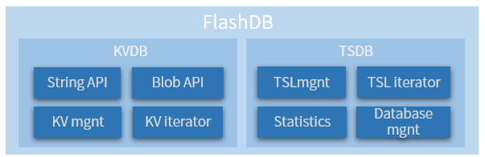

# Quick start

This document will help users quickly use FlashDB on the demo platform and experience the actual use of FlashDB

## basic concepts

- **Key-Value Database (KVDB)**: It is a non-relational database that stores data as a collection of key-value pairs, where the key is used as a unique identifier. KVDB has simple operation and strong scalability.
- **Time Series Data (TSDB)**: Time Series Database (TSDB), which stores data in **time sequence**. TSDB data has a timestamp, a large amount of data storage, and high insertion and query performance.
- **Time series log (TSL)**: TSL (Time series log) is the abbreviation of each record in TSDB.
- **Blob**: In a computer, blob is often a field type used to store binary files in a database. In FlashDB, both KV and TSL use the blob type for storage, which can be compatible with any variable type.
- **Iterator**: It allows users to visit every element in the container through a specific interface without knowing the underlying implementation. Both TSDB and KVDB support traversal access to the database through iterators.

## Functional block diagram

Through the following functional block diagram, you can roughly understand the FlashDB functional module division

## Prepare the development environment

Before use, you need to install the following development software on your PC in advance

### Integrated Development Environment

The demo project provided by FlashDB supports two projects by default:

- **RT-Studio**: Free to use, easy to use, download address: https://www.rt-thread.io/studio.html
- **Keil MDK**: MDK v5 version of the integrated development environment needs to be installed

### Serial port tool

Prepare `Serial debugging assistant` or `Serial terminal tool`, and you need to use it when viewing the running log later

## Get the source code

The latest code is currently hosted on GitHub. The master branch is the development version. It is recommended to download the released version

- GitHub download: https://github.com/armink/FlashDB/releases

## Choose a demo platform

In the `demos` directory of the project, the following hardware demonstration platforms are currently provided. You can choose a hardware platform and experience the running process of FlashDB on a real machine.

For more detailed introduction, click on the **instructions** in the table below to view.

| Hardware Platform     | Path                          | Flash Type    | Instructions                                         |
| --------------------- | ----------------------------- | :------------ | ---------------------------------------------------- |
| stm32f10x             | `demos/stm32f103ve`           | stm32 on-chip | [click to view](demo-stm32f103ve.md)           |
| stm32f40x             | `demos/stm32f405rg`           | stm32 on-chip | [click to view](demo-stm32f405rg.md)           |
| stm32f40x + spi flash | `demos/stm32f405rg_spi_flash` | spi flash     | [click to view](demo-stm32f405rg-spi-flash.md) |

## View sample description

If you don't have a suitable demo platform above, you can also check the example instructions you are interested in first.

| Sample file                         | Description               | Detailed explanation                           |
| ----------------------------------- | ------------------------- | ---------------------------------------------- |
| `samples/kvdb_basic_sample.c`       | KVDB basic example        | [click to view](sample-kvdb-basic)       |
| `samples/kvdb_type_string_sample.c` | KV example of string type | [click to view](sample-kvdb-type-string) |
| `samples/kvdb_type_blob_sample.c`   | Blob type KV example      | [click to view](sample-kvdb-type-blob)   |
| `samples/tsdb_sample.c`             | TSDB basic example        | [click to view](sample-tsdb-basic)       |