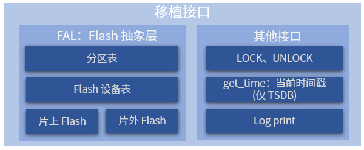

# 移植指南

FlashDB 底层的 Flash 管理及操作依赖于 RT-Thread 的 FAL (Flash Abstraction Layer) Flash 抽象层开源软件包 ，该开源库也支持运行在 **裸机平台** [(点击查看介绍)](http://packages.rt-thread.org/detail.html?package=fal)。所以只需要将所用到的 Flash 对接到 FAL ，即可完成整个移植工作。

## 移植介绍



移植的主要工作都在 FAL 这边，其他接口并不是强依赖，可以根据自己的情况进行对接。

移植前建议先了解下 FAL 功能介绍，详见：http://packages.rt-thread.org/detail.html?package=fal

FAL 底层将不同的 Flash 存储介质进行了统一封装，并提供了分区表机制，暴露给上层用户。

FlashDB 的每个数据库就是基于 FAL 提供的分区机制，每个数据库都坐落在某个 FAL 的分区上，相当于一个分区对应一个数据库。

下面将详细讲解 FAL 的移植流程，更多移植演示可以参考已经提供的 demo 。

## FAL 移植

### 定义 flash 设备

在定义 Flash 设备表前，需要先定义 Flash 设备。可以是片内 flash, 也可以是片外基于 SFUD 的 spi flash：

- 定义片内 flash 设备可以参考 [`fal_flash_stm32f2_port.c`](https://github.com/RT-Thread-packages/fal/blob/master/samples/porting/fal_flash_stm32f2_port.c) 。
- 定义片外 spi flash 设备可以参考 [`fal_flash_sfud_port.c`](https://github.com/RT-Thread-packages/fal/blob/master/samples/porting/fal_flash_sfud_port.c) 。

定义具体的 Flash 设备对象，用户需要根据自己的 Flash 情况分别实现 `init`、 `read`、 `write`、 `erase` 这些操作函数：

- `static int init(void)`：**可选** 的初始化操作。
- `static int read(long offset, uint8_t *buf, size_t size)`：读取操作。

| 参数   | 描述                      |
| ------ | ------------------------- |
| offset | 读取数据的 Flash 偏移地址 |
| buf    | 存放待读取数据的缓冲区    |
| size   | 待读取数据的大小          |
| return | 返回实际读取的数据大小    |

- `static int write(long offset, const uint8_t *buf, size_t size)` ：写入操作。

| 参数   | 描述                      |
| ------ | ------------------------- |
| offset | 写入数据的 Flash 偏移地址 |
| buf    | 存放待写入数据的缓冲区    |
| size   | 待写入数据的大小          |
| return | 返回实际写入的数据大小    |

- `static int erase(long offset, size_t size)` ：擦除操作。

| 参数   | 描述                      |
| ------ | ------------------------- |
| offset | 擦除区域的 Flash 偏移地址 |
| size   | 擦除区域的大小            |
| return | 返回实际擦除的区域大小    |

用户需要根据自己的 Flash 情况分别实现这些操作函数。在文件最底部定义了具体的 Flash 设备对象 ，如下示例定义了 stm32f2 片上 flash：stm32f2_onchip_flash

```C
const struct fal_flash_dev stm32f2_onchip_flash =
{
    .name       = "stm32_onchip",
    .addr       = 0x08000000,
    .len        = 1024*1024,
    .blk_size   = 128*1024,
    .ops        = {init, read, write, erase},
    .write_gran = 8
};
```

- `"stm32_onchip"` : Flash 设备的名字。

- `0x08000000`: 对 Flash 操作的起始地址。

- `1024*1024`：Flash 的总大小（1MB）。

- `128*1024`：Flash 块/扇区大小（因为 STM32F2 各块大小不均匀，所以擦除粒度为最大块的大小：128K）。

- `{init, read, write, erase}` ：Flash 的操作函数。 如果没有 init 初始化过程，第一个操作函数位置可以置空。

- `8`   : 设置写粒度，单位 bit， 0 表示未生效（默认值为 0 ），该成员是 fal 版本大于 0.4.0 的新增成员。各个 flash 写入粒度不尽相同，可通过该成员进行设置，以下列举几种常见 Flash 写粒度：
  - nor flash: 1 bit
  - stm32f2/f4: 8 bit
  - stm32f1: 32 bit
  - stm32l4: 64 bit

### 定义 flash 设备表

Flash 设备表定义在 `fal_cfg.h` 头文件中，定义分区表前需 **新建 `fal_cfg.h` 文件** ，请将该文件统一放在对应 BSP 或工程目录的 port 文件夹下，并将该头文件路径加入到工程。fal_cfg.h 可以参考 [示例文件 fal/samples/porting/fal_cfg.h](https://github.com/RT-Thread-packages/fal/blob/master/samples/porting/fal_cfg.h) 完成。

设备表示例：

```C
/* ===================== Flash device Configuration ========================= */
extern const struct fal_flash_dev stm32f2_onchip_flash;
extern struct fal_flash_dev nor_flash0;

/* flash device table */
#define FAL_FLASH_DEV_TABLE                                          \
{                                                                    \
    &stm32f2_onchip_flash,                                           \
    &nor_flash0,                                                     \
}
```

Flash 设备表中，有两个 Flash 对象，一个为 STM32F2 的片内 Flash ，一个为片外的 Nor Flash。

### 定义 flash 分区表

分区表也定义在 `fal_cfg.h` 头文件中。Flash 分区基于 Flash 设备，每个 Flash 设备又可以有 N 个分区，这些分区的集合就是分区表。在配置分区表前，务必保证已定义好 **Flash 设备** 及 **设备表**。fal_cfg.h 可以参考 [示例文件 fal/samples/porting/fal_cfg.h](https://github.com/RT-Thread-packages/fal/blob/master/samples/porting/fal_cfg.h) 完成。

分区表示例：

```C
#define NOR_FLASH_DEV_NAME             "norflash0"
/* ====================== Partition Configuration ========================== */
#ifdef FAL_PART_HAS_TABLE_CFG
/* partition table */
#define FAL_PART_TABLE                                                               \
{                                                                                    \
    {FAL_PART_MAGIC_WORD,        "bl",     "stm32_onchip",         0,   64*1024, 0}, \
    {FAL_PART_MAGIC_WORD,       "app",     "stm32_onchip",   64*1024,  704*1024, 0}, \
    {FAL_PART_MAGIC_WORD, "easyflash", NOR_FLASH_DEV_NAME,         0, 1024*1024, 0}, \
    {FAL_PART_MAGIC_WORD,  "download", NOR_FLASH_DEV_NAME, 1024*1024, 1024*1024, 0}, \
}
#endif /* FAL_PART_HAS_TABLE_CFG */
```

上面这个分区表详细描述信息如下：

| 分区名      | Flash 设备名   | 偏移地址  | 大小  | 说明               |
| ----------- | -------------- | --------- | ----- | ------------------ |
| "bl"        | "stm32_onchip" | 0         | 64KB  | 引导程序           |
| "app"       | "stm32_onchip" | 64*1024   | 704KB | 应用程序           |
| "easyflash" | "norflash0"    | 0         | 1MB   | EasyFlash 参数存储 |
| "download"  | "norflash0"    | 1024*1024 | 1MB   | OTA 下载区         |

用户需要修改的分区参数包括：分区名称、关联的 Flash 设备名、偏移地址（相对 Flash 设备内部）、大小，需要注意以下几点：

- 分区名保证 **不能重复**；
- 关联的 Flash 设备 **务必已经在 Flash 设备表中定义好** ，并且 **名称一致** ，否则会出现无法找到 Flash 设备的错误；
- 分区的起始地址和大小 **不能超过 Flash 设备的地址范围** ，否则会导致包初始化错误；

> 注意：每个分区定义时，除了填写上面介绍的参数属性外，需在前面增加 `FAL_PART_MAGIC_WORD` 属性，末尾增加 `0` （目前用于保留功能）

