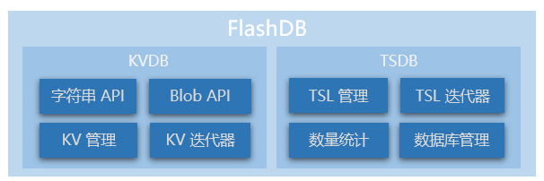

# 快速开始

本文档将帮助用户快速的将 FlashDB 在演示平台上使用起来，体验 FlashDB 的实际使用效果

## 基本概念

- **键值数据库（KVDB）**：是一种非关系数据库，它将数据存储为键值（Key-Value）对集合，其中键作为唯一标识符。KVDB 操作简洁，可扩展性强。
- **时序数据（TSDB）** ：时间序列数据库 （Time Series Database , 简称 TSDB），它将数据按照 **时间顺序存储** 。TSDB 数据具有时间戳，数据存储量大，插入及查询性能高。
- **时序记录（TSL）** ：TSL (Time series log)，是 TSDB 中每条记录的简称。
- **Blob** ：在计算机中，blob 常常是数据库中用来存储二进制文件的字段类型。在 FlashDB 中， KV 和 TSL 都使用 blob 类型来存储，该类型可以兼容任意变量类型。
- **迭代器（iterator）**：它可以让用户透过特定的接口巡访容器中的每一个元素，而不用了解底层的实现。 TSDB 和 KVDB 都支持通过迭代器对数据库进行遍历访问。

## 功能框图

通过下面的功能框图，可以大致了解 FlashDB 功能模块划分

## 准备开发环境

使用前，需提前在 PC 上安装下面的开发软件

### 集成开发环境

FlashDB 提供的演示工程默认支持两种工程： 

- **RT-Studio** ：免费使用，支持中文，使用方便，下载地址：https://www.rt-thread.org/page/studio.html
- **Keil MDK** ：需安装 MDK v5 版本的集成开发环境

### 串口工具

准备 `串口调试助手` 或 `串口终端工具` ，后续需要在查看运行日志时使用

## 获取源码

最新代码目前托管在 GitHub 及 Gitee ，master 分支为开发版本，推荐下载已发布的版本

- GitHub 下载：https://github.com/armink/FlashDB/releases
- Gitee 下载：https://gitee.com/armink/FlashDB/releases

## 选择演示平台

在项目的 `demos` 目录下，目前已提供下面一些硬件演示平台，可以选择一个硬件平台，真机体验一下 FlashDB 的运行过程。

更多详细介绍，点击下方表格中的 **使用说明** 进行查看。

| 硬件平台              | 路径                          | flash 类型    | 使用说明                                        |
| --------------------- | :---------------------------- | :------------ | ----------------------------------------------- |
| stm32f10x             | `demos/stm32f103ve`           | stm32 on-chip | [点击查看](zh-cn/demo-stm32f103ve.md)           |
| stm32f40x             | `demos/stm32f405rg`           | stm32 on-chip | [点击查看](zh-cn/demo-stm32f405rg.md)           |
| stm32f40x + spi flash | `demos/stm32f405rg_spi_flash` | spi flash     | [点击查看](zh-cn/demo-stm32f405rg-spi-flash.md) |

## 查看示例说明

如果上面没有合适自己的演示平台，也可以先查看一下感兴趣的示例说明。

| 示例文件                            | 说明               | 详解                                      |
| ----------------------------------- | ------------------ | ----------------------------------------- |
| `samples/kvdb_basic_sample.c`       | KVDB 基础示例      | [点击查看](zh-cn/sample-kvdb-basic)       |
| `samples/kvdb_type_string_sample.c` | 字符串类型 KV 示例 | [点击查看](zh-cn/sample-kvdb-type-string) |
| `samples/kvdb_type_blob_sample.c`   | blob 类型 KV 示例  | [点击查看](zh-cn/sample-kvdb-type-blob)   |
| `samples/tsdb_sample.c`             | TSDB 基础示例      | [点击查看](zh-cn/sample-tsdb-basic)       |

